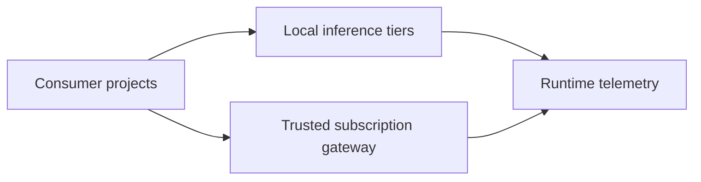

# LLM Runtime

`llm-runtime` is the shared inference and trusted-provider infrastructure for
Homel projects.

Its architectural purpose is to keep model-serving capacity, provider
transports, subscription credentials, and runtime telemetry outside consumer
projects while exposing stable service contracts to those consumers.

**Status:** implemented infrastructure.

## Architectural Stance

The repository owns two classes of runtime capability:

- local inference tiers for shared model-serving capacity;
- a trusted OpenAI-compatible gateway for subscription-backed providers.

Consumer projects depend on runtime interfaces, not on GPU placement,
quantization, provider login mechanics, or credential storage.

Provider credentials remain inside trusted runtime infrastructure. Consumer
workloads do not receive those credentials as part of the runtime contract.

## Authority Boundary

`llm-runtime` decides and enforces runtime infrastructure concerns:

- model-serving deployment and service discovery;
- trusted provider transport and authentication storage;
- runtime network boundaries;
- runtime health and telemetry publication.

Consumer projects retain authority over application behavior:

- prompts and schemas;
- workflow and role semantics;
- tool execution;
- retry, fallback, and budget policy;
- persistence and correctness evaluation.

If a runtime interface is unavailable, the runtime reports infrastructure
failure. It does not reinterpret consumer intent or select a different
application policy on the consumer's behalf.

## Architecture

The diagram describes one boundary: consumers call shared runtime services;
the runtime owns the infrastructure behind those services and publishes its
Observed State through telemetry.

## Documentation

- [Documentation style guide](docs/00_style_guide.md)
- [Architecture overview](docs/01_overview.md)
- [Runtime contract](docs/02_runtime_contract.md)
- [Operations guide](docs/03_operations.md)
- [Gateway architecture and operations](docs/04_gateway.md)

Operational commands, concrete model identities, provider transports, image
promotion, rollback, and diagnostics belong in the linked documents rather
than in this top-level README.
