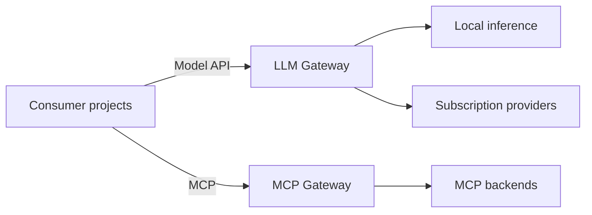

# LLM Runtime

`llm-runtime` is shared model-serving and trusted runtime infrastructure for
Homel projects.

Its purpose is to keep model capacity, provider transports, credentials, MCP
backend routing, and runtime network boundaries outside consumer projects while
exposing stable runtime contracts to those consumers.

**Status:** implemented infrastructure.

## Architectural Stance

The repository owns two runtime planes:

- an LLM plane that exposes one consumer-facing gateway for local and
  subscription-backed models;
- an MCP plane that exposes one controlled ingress for explicitly published
  backend capabilities.

Consumer projects depend on runtime interfaces rather than GPU placement,
provider login mechanics, backend Service addresses, or credential storage.

## Authority Boundary

`llm-runtime` decides and enforces:

- model-serving deployment and runtime routing;
- trusted provider transport and authentication storage;
- MCP ingress, backend routing, and public capability exposure;
- runtime network boundaries;
- runtime telemetry publication.

Consumer projects retain authority over:

- prompts and schemas;
- workflow and role semantics;
- tool invocation policy;
- retry, fallback, and budget policy;
- persistence;
- correctness and quality evaluation.

Runtime failure remains infrastructure failure. The runtime does not reinterpret
consumer intent or select an application fallback on the consumer's behalf.

## Documentation

- [Documentation style guide](docs/00_style_guide.md)
- [Architecture overview](docs/01_overview.md)
- [Runtime contract](docs/02_runtime_contract.md)
- [Operations guide](docs/03_operations.md)
- [LLM gateway architecture and operations](docs/04_gateway.md)
- [MCP gateway architecture and operations](docs/06_mcp_service.md)

Operational commands, concrete model identities, provider transports, contract
versioning, failure behavior, and deployment mechanics belong in the linked
documents rather than in this top-level README.
