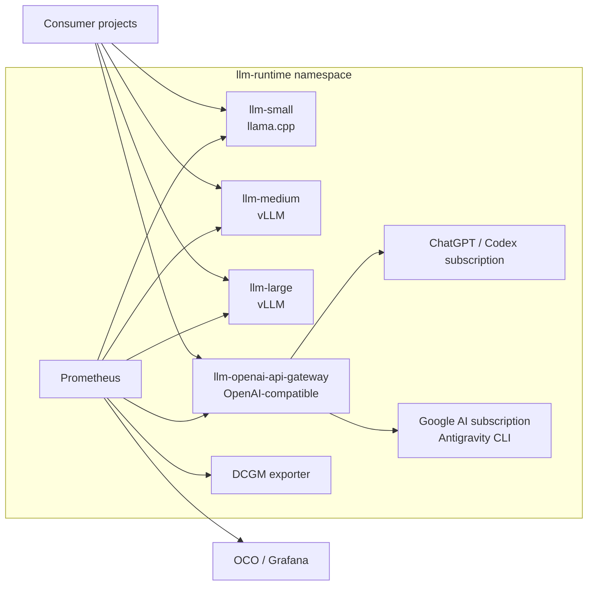

# LLM Runtime

[](https://github.com/homel-dev/llm-runtime/actions/workflows/gateway-image.yml)
[](https://github.com/homel-dev/llm-runtime/commits/main)


Shared LLM serving infrastructure for Homel projects. The repository owns local
model-serving tiers, the trusted subscription gateway, their Kubernetes
contracts, runtime observability, and operational tooling.

**Repository:** `homel-dev/llm-runtime`
**Namespace:** `llm-runtime`
**Status:** implemented infrastructure; deployment is split into explicit
runtime, gateway, observability, and OCO-consumer lifecycles.

## What this repository owns

- `small`, `medium`, and `large` local inference services;
- stable OpenAI-compatible service endpoints;
- the trusted OpenAI-compatible subscription gateway;
- ChatGPT/Codex and Google AI subscription authentication state;
- gateway image source, tests, CI build, and GHCR publication;
- Kubernetes manifests and NetworkPolicy;
- Prometheus and DCGM runtime metrics;
- OCO/Grafana datasource and dashboards;
- deployment, health, smoke, benchmark, and diagnostics tasks.

Consumer projects still own prompts, schemas, workflow semantics, authority,
retry policy, persistence, and project-level quality evaluation.

## Architecture



## Current runtime tiers

The model identities below describe the current manifests. They are deployment
implementation details, not stable consumer contract fields.

| Tier | Current model | Runtime | Service |
| --- | --- | --- | --- |
| `small` | `Qwen/Qwen2.5-7B-Instruct-GGUF:Q4_K_M` | llama.cpp server | `llm-small:8000` |
| `medium` | `curiousmind147/microsoft-phi-4-AWQ-4bit-GEMM` | vLLM | `llm-medium:8000` |
| `large` | `DeepSeek-R1-Distill-Llama-70B-AWQ` | vLLM, 3-GPU pipeline parallel | `llm-large:8000` |

Stable cluster endpoints are published by `k8s/runtime-contract.yml`:

```text
http://llm-small.llm-runtime.svc.cluster.local:8000
http://llm-medium.llm-runtime.svc.cluster.local:8000
http://llm-large.llm-runtime.svc.cluster.local:8000
http://llm-openai-api-gateway.llm-runtime.svc.cluster.local:8000
```

## Trusted subscription gateway

`llm-runtime` owns the gateway implementation and credentials. RR and other
projects consume it as a runtime service.

Current advertised gateway model IDs:

| Model ID | Provider path |
| --- | --- |
| `gpt-5.6-sol` | ChatGPT/Codex subscription through `openai-oauth` |
| `gemini-subscription-pro` | Google AI subscription through Antigravity `gemini-3.1-pro-high` |
| `gemini-subscription-auto` | compatibility alias pinned to Antigravity `gemini-3.7-flash-medium` |

`gemini-subscription-auto` is a stable compatibility name; it is not dynamic
provider-side auto-selection.

See [docs/04_gateway.md](docs/04_gateway.md) for authentication, API limits,
security boundaries, CI image publication, deployment, and telemetry.

## Quick start

Prerequisites: Docker, Minikube, `kubectl`, Task, and `jq`. NVIDIA GPU support
is required for the GPU-backed tiers.

Start Minikube if needed:

```bash
task miniup
```

Deploy the local inference tiers and runtime contract:

```bash
task up
task status
```

Validate local tiers:

```bash
task llm:list-small
task llm:list-medium
task llm:list-large

task llm:smoke-small
task llm:smoke-medium
task llm:smoke-large
```

For a local Minikube gateway image:

```bash
task gateway:verify
task gateway:image:build
```

Populate subscription authentication when a PVC is new or credentials have
expired:

```bash
task gateway:subscription:login
task gateway:gemini:login
```

Deploy and validate the gateway:

```bash
task gateway:deploy
task gateway:status
task gateway:gemini:check
```

Deploy metrics and the OCO/Grafana consumer contract:

```bash
task gateway:observability:deploy
task observability:gateway-up
```

## Gateway CI and GHCR

`.github/workflows/gateway-image.yml` is the canonical remote gateway image
build.

- pull requests: verify + `linux/amd64` image build, no registry write;
- `main`, `v*` tags, and manual dispatch: verify + build + GHCR publication;
- image: `ghcr.io/homel-dev/llm-runtime-gateway`;
- published metadata includes commit-SHA/ref tags, SBOM, and provenance;
- BuildKit layers use the GitHub Actions cache;
- deployment should promote an immutable image digest.

Example:

```bash
LLM_GATEWAY_IMAGE='ghcr.io/homel-dev/llm-runtime-gateway@sha256:<digest>' \
  task gateway:deploy
```

For a private package, create `ghcr-pull-secret` in `llm-runtime` before the
Deployment attempts to pull the image.

The image digest is immutable. Rebuilding the same commit is not yet guaranteed
to be bit-for-bit reproducible because the Dockerfile currently installs the
then-current official Antigravity CLI release.

## Observability

Runtime-owned Prometheus scrapes:

- llama.cpp/vLLM tier metrics on `:8000/metrics`;
- gateway metrics on the dedicated `:9091/metrics` port;
- DCGM exporter on `:9400/metrics`.

The gateway exports request counts, backend/model/status labels, latency
histograms, in-flight requests, transport errors/timeouts, policy rejects,
traffic bytes, last-success/error timestamps, uptime, and RSS.

OCO consumer ConfigMaps publish:

- the general `LLM Runtime` dashboard;
- the `LLM Runtime Gateway` dashboard;
- the Prometheus datasource contract;
- read-only RBAC for the observability console.

Useful checks:

```bash
task observability:targets
task observability:vllm-up
task observability:gateway-target
task observability:gateway-up
task gateway:metrics
```

## Deployment lifecycle

The lifecycles are intentionally separate:

| Component | Deploy | Delete/status |
| --- | --- | --- |
| inference tiers + runtime contract | `task up` | `task down`, `task status` |
| subscription gateway | `task gateway:deploy` | `task gateway:delete`, `task gateway:status` |
| Prometheus + DCGM | `task observability:deploy` | `task observability:delete`, `task observability:status` |
| OCO consumer contract | `task oco-consumer:deploy` | `task oco-consumer:delete`, `task oco-consumer:status` |

`task up` does **not** deploy the gateway or observability resources.

## Repository layout

```text
.
├── .github/workflows/gateway-image.yml
├── README.md
├── Taskfile.yml
├── docs/
│   ├── 00_style_guide.md
│   ├── 01_overview.md
│   ├── 02_runtime_contract.md
│   ├── 03_operations.md
│   └── 04_gateway.md
├── gateway/
│   ├── Dockerfile
│   ├── package.json
│   ├── src/
│   └── test/
├── k8s/
│   ├── small/
│   ├── medium/
│   ├── large/
│   ├── gateway/
│   ├── observability/
│   ├── oco-consumer/
│   ├── runtime-contract.yml
│   └── networkpolicy.yml
├── scripts/
└── hack/
```

## Documentation

- [Architecture overview](docs/01_overview.md)
- [Runtime contract](docs/02_runtime_contract.md)
- [Operations guide](docs/03_operations.md)
- [Gateway](docs/04_gateway.md)
- [Documentation style guide](docs/00_style_guide.md)

The manifests and `Taskfile.yml` are executable truth. Documentation describes
those contracts and should be updated in the same change when they change.
