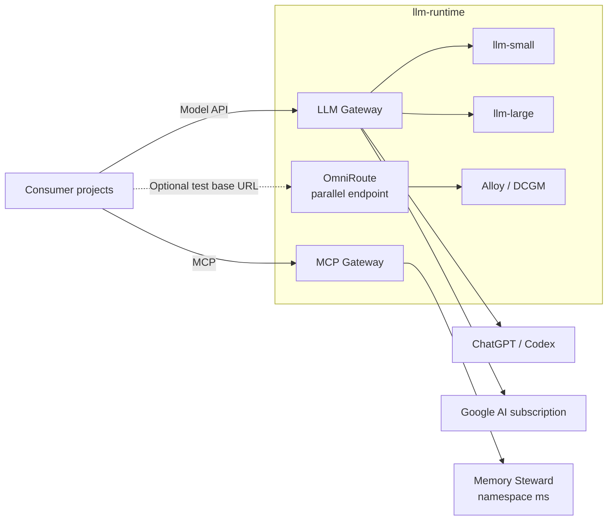

# SHARED LLM RUNTIME MODEL

*Shared model-serving, provider, and MCP infrastructure — architecture specification.*

---

## Table of Contents

- [0. Status, Scope, and Authority](#0-status-scope-and-authority)
- [1. Purpose](#1-purpose)
- [2. Design Principles](#2-design-principles)
- [3. Runtime Architecture](#3-runtime-architecture)
- [4. Local Inference Tiers](#4-local-inference-tiers)
- [5. Runtime Gateways](#5-runtime-gateways)
- [6. Runtime Contract](#6-runtime-contract)
- [7. Consumer Ownership Boundary](#7-consumer-ownership-boundary)
- [8. Network and Security Boundary](#8-network-and-security-boundary)
- [9. Observability Model](#9-observability-model)
- [10. Repository Ownership](#10-repository-ownership)
- [11. Deployment Lifecycles](#11-deployment-lifecycles)
- [12. Non-Goals](#12-non-goals)
- [13. Tradeoffs and Failure Modes](#13-tradeoffs-and-failure-modes)

---

## 0. Status, Scope, and Authority

**Status:** IMPLEMENTED.

This document describes architecture implemented by the current
`llm-runtime` manifests, gateway source, Taskfile, and observability resources.
Executable configuration is authoritative when prose and implementation
diverge.

Authority is divided deliberately:

- `llm-runtime` has authority over shared model-serving infrastructure,
  provider transports, runtime credentials, network boundaries, and runtime
  telemetry;
- consumer projects have authority over prompts, schemas, workflow semantics,
  tool execution, project policy, persistence, and quality evaluation.

Enforcement is provided by Kubernetes resource ownership, Service contracts,
NetworkPolicy, provider credential placement, and process failure. A runtime
component does not acquire authority to reinterpret consumer behavior when an
infrastructure dependency fails.

[Back to top](#shared-llm-runtime-model)

---

## 1. Purpose

Homel projects require reusable access to local inference capacity,
subscription-backed frontier models, and shared MCP capabilities provided by
independently owned backend services.

Duplicating model servers, provider transports, credentials, MCP routing, and
runtime network policy inside every consumer would multiply operational and
security surface.

`llm-runtime` centralizes those infrastructure concerns while preserving
consumer ownership of application meaning.

[Back to top](#shared-llm-runtime-model)

---

## 2. Design Principles

### Stable interfaces, replaceable implementation

Consumers depend on Service endpoints and advertised model IDs. GPU placement,
quantization, container topology, and current local model identity are runtime
implementation details unless a contract explicitly promotes them.

### Provider credentials remain in trusted infrastructure

Subscription credentials and provider transports belong to `llm-runtime`.
They are not part of hostile jobs or project agent configuration.

### Project independence

Sharing inference infrastructure does not imply shared prompts, schemas,
workflows, policies, persistence, or authority.

### Observable infrastructure

Alloy is the namespace-local telemetry collector. It scrapes Prometheus-format
endpoints, receives OTLP from MCP and OmniRoute, performs the OmniRoute blackbox
probe, and forwards metrics, logs, and traces to the shared OCO backends.

### Explicit lifecycle boundaries

Local inference, gateways, MCP, and telemetry collection have separate
lifecycles. OCO owns shared telemetry storage and Grafana presentation.
Failure in one lifecycle does not authorize another lifecycle to change
consumer policy.

[Back to top](#shared-llm-runtime-model)

---

## 3. Runtime Architecture

Runtime-owned Kubernetes resources use the `llm-runtime` namespace except for
backend-specific policy that must be installed in a backend namespace.



All active consumer model traffic enters through the LLM gateway. Local
inference Services are trusted gateway upstreams rather than general consumer
endpoints.

MCP access uses a separate ingress and routing plane. Neither gateway acquires
authority over consumer workflow semantics.

[Back to top](#shared-llm-runtime-model)

---

## 4. Local Inference Tiers

The repository retains three tier directories:

```text
small
medium
large
```

The active root Kustomization deploys only `small` and `large`.

| Tier | Desired State | Current implementation | Current model | Capacity |
| --- | --- | --- | --- | --- |
| `small` | active | llama.cpp server | `Qwen/Qwen2.5-7B-Instruct-GGUF:Q4_K_M` | CPU-backed |
| `medium` | disabled | retained vLLM manifest | `curiousmind147/microsoft-phi-4-AWQ-4bit-GEMM` | 1 GPU when enabled |
| `large` | active | vLLM | `Qwen2.5-72B-Instruct-AWQ` | 3 GPUs, pipeline parallel |

The active consumer contract exposes local capacity through gateway aliases:

```text
llm-small
llm-large
```

`LLM_MEDIUM_MODEL` is empty in contract version `v2`.

Concrete model identities are Observed State. Consumers that require a concrete
identity must validate the advertised model contract.

[Back to top](#shared-llm-runtime-model)

---

## 5. Runtime Gateways

The existing consumer-facing LLM endpoint is:

```text
http://llm-openai-api-gateway.llm-runtime.svc.cluster.local:8000
```

OmniRoute is exposed independently for controlled consumer testing at:

```text
http://llm-openai-api-gateway-omniroute.llm-runtime.svc.cluster.local:8000
```

The Services are parallel; deploying OmniRoute does not change the existing
gateway Service selector or endpoint. The consumer data plane does not require a
client API key, allowing RR to test it by changing only the configured base URL.

Current configured model aliases are:

| Gateway model | Trusted backend |
| --- | --- |
| `llm-small` | local small inference Service |
| `llm-large` | local large inference Service |
| `gpt-5.6-sol` | stateful ChatGPT/Codex Responses transport |
| `gemini-subscription-pro` | direct Cloud Code Assist transport using `gemini-pro-agent` |
| `gemini-subscription-auto` | direct Cloud Code Assist transport using `gemini-3.7-flash-medium` |
| `glm-5.3` | direct Z.AI Coding Plan Chat Completions transport |
| `glm-5.3-flash` | direct Z.AI Coding Plan Chat Completions transport |

The consumer-facing MCP endpoint is:

```text
http://llm-runtime-mcp.llm-runtime.svc.cluster.local:8000/mcp
```

The current Memory Steward route allowlists:

```text
memory.retrieve_context
memory.reference.search
memory.reference.get
```

Clients discover the public multiplexed MCP tool names through `tools/list`.

Detailed behavior is defined in [04_gateway.md](04_gateway.md) and
[06_mcp_service.md](06_mcp_service.md).

[Back to top](#shared-llm-runtime-model)

---

## 6. Runtime Contract

`k8s/runtime-contract.yml` publishes contract version `v2`.

All model base URL keys terminate at the LLM gateway:

```text
LLM_SMALL_BASE_URL
LLM_MEDIUM_BASE_URL
LLM_LARGE_BASE_URL
LLM_GATEWAY_BASE_URL
```

Model selection is published separately:

```text
LLM_SMALL_MODEL=llm-small
LLM_MEDIUM_MODEL=
LLM_LARGE_MODEL=llm-large
```

The MCP contract publishes:

```text
MCP_GATEWAY_BASE_URL
MCP_GATEWAY_URL
MCP_RETRIEVE_TOOL
```

Runtime metadata publishes:

```text
LLM_RUNTIME_NAMESPACE
LLM_API_COMPATIBILITY
CONTRACT_VERSION
```

A base URL does not imply that a corresponding tier is active.

[Back to top](#shared-llm-runtime-model)

---

## 7. Consumer Ownership Boundary

Consumer projects own:

- prompts and schemas;
- workflow and role behavior;
- authority boundaries;
- project timeout and retry policy;
- persistence;
- project-specific tools;
- correctness and quality evaluation;
- project-level observability.

`llm-runtime` owns:

- local model serving;
- stable runtime Services;
- gateway source and provider transports;
- subscription auth PVCs and login helpers;
- gateway image build and publication;
- runtime NetworkPolicy and gateway consumer RBAC;
- Alloy and DCGM runtime telemetry collection;
- forwarding runtime telemetry to OCO shared backends;
- runtime deployment and diagnostics tooling.

**Invariant:** `llm-runtime` owns model and provider infrastructure; consumers
own application meaning and authority.

[Back to top](#shared-llm-runtime-model)

---

## 8. Network and Security Boundary

Local inference Pods carry `app.kubernetes.io/component: inference`.

The active general runtime NetworkPolicy permits local inference TCP/8000 from
the LLM gateway and Alloy. Consumer workloads therefore use the LLM gateway
rather than receiving direct local inference access from that policy.

The LLM gateway has separate ingress and egress policy for approved RR agent
Pods, Alloy metrics scraping, local inference upstreams, DNS, and required
public provider endpoints.

The MCP gateway has separate policy for approved RR agent Pods, the runtime
operator-check Pod, Alloy metrics/OTLP traffic, DNS, and Memory Steward TCP/8081.

A backend-side NetworkPolicy in namespace `ms` permits Memory Steward ingress
from the runtime MCP gateway data-plane Pods.

Provider and backend credentials remain outside the public runtime ConfigMap
contract.

[Back to top](#shared-llm-runtime-model)

---

## 9. Observability Model

`llm-runtime` owns telemetry collection only. OCO owns shared telemetry storage,
querying, and Grafana presentation.

Alloy scrapes local inference `/metrics`, gateway TCP/9091, MCP Envoy
`/stats/prometheus`, DCGM TCP/9400, and its own metrics. The embedded Alloy
blackbox exporter probes the OmniRoute `/healthz` endpoint. MCP and OmniRoute
send OTLP directly to `alloy.llm-runtime.svc.cluster.local`.

Alloy forwards metrics to OCO VictoriaMetrics, logs to VictoriaLogs, and traces
to Tempo through the central OCO Alloy ingress. OmniRoute span-derived RED
metrics are written only to the shared OCO metrics backend.

There is no namespace-local Prometheus, Tempo, Loki, OTel Collector, standalone
Blackbox Exporter, or Grafana datasource/dashboard provisioning in
`llm-runtime`.

Desired State is expressed by manifests and runtime configuration. Observed
State is produced by Kubernetes status, health checks, and telemetry. A mismatch
between those states is Drift and requires operator reconciliation.

[Back to top](#shared-llm-runtime-model)

---

## 10. Repository Ownership

Relevant repository areas are:

```text
gateway/                 trusted LLM gateway implementation and tests
k8s/small/               active small local tier
k8s/medium/              retained disabled medium tier
k8s/large/               active large local tier
k8s/gateway/             LLM gateway Deployment, Service, PVCs, RBAC, login Pods
k8s/mcp/                 MCP Gateway API, MCPRoute, backend and network policy
k8s/observability/       Alloy and DCGM telemetry collection
k8s/runtime-contract.yml stable consumer contract
scripts/                 runtime, gateway, MCP, and diagnostics helpers
taskfiles/mcp.yml        MCP lifecycle and validation tasks
hack/                    benchmark helpers
```

Gateway image CI is owned by `.github/workflows/gateway-image.yml`.

[Back to top](#shared-llm-runtime-model)

---

## 11. Deployment Lifecycles

The operator-facing lifecycles are:

1. local inference and runtime contract through `task up`;
2. LLM gateway through `task gateway:deploy`;
3. MCP gateway through `task mcp:deploy`;
4. telemetry collection through `task obs:deploy`.

The root Kustomization includes `small` and `large`. Medium resources remain in
the repository but are not included in that Desired State.

`task up` reapplies the authored general NetworkPolicy after the root
Kustomization.

The MCP lifecycle installs pinned Envoy Gateway and Envoy AI Gateway controller
prerequisites before applying the runtime MCP data plane.

Operational procedures are defined in [03_operations.md](03_operations.md).

[Back to top](#shared-llm-runtime-model)

---

## 12. Non-Goals

`llm-runtime` does not define:

- project agent roles;
- prompt or schema ownership;
- application workflow control;
- project persistence;
- correctness policy;
- project retry or fallback policy;
- project tool authority.

Those decisions remain with consumers.

[Back to top](#shared-llm-runtime-model)

---

## 13. Tradeoffs and Failure Modes

The architecture accepts explicit costs:

- centralizing provider credentials reduces duplication but makes the gateway a
  shared dependency for subscription-backed consumers;
- stable tier names decouple consumers from concrete models but do not guarantee
  a permanent model identity behind a tier;
- separate deployment lifecycles reduce accidental coupling but require the
  operator to reconcile more than one Desired State;
- passive provider telemetry cannot detect expired subscription credentials
  until traffic or a deliberate end-to-end check exercises the provider path;
- NetworkPolicy constrains reachability but cannot prove provider identity,
  quota, or availability.

Failure behavior is fail-visible rather than policy-substituting. If a local
tier, provider transport, credential, or gateway model is unavailable, the
runtime surfaces failure through HTTP status, process state, Kubernetes status,
or telemetry. It does not select a different consumer workflow or model policy
without an explicit consumer decision.

[Back to top](#shared-llm-runtime-model)

---

**END OF DOCUMENT**
