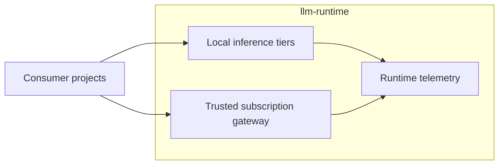

# SHARED LLM RUNTIME MODEL

*Shared inference and trusted provider infrastructure — architecture specification.*

---

## Table of Contents

- [0. Status, Scope, and Authority](#0-status-scope-and-authority)
- [1. Purpose](#1-purpose)
- [2. Design Principles](#2-design-principles)
- [3. Runtime Architecture](#3-runtime-architecture)
- [4. Local Inference Tiers](#4-local-inference-tiers)
- [5. Trusted Subscription Gateway](#5-trusted-subscription-gateway)
- [6. Runtime Contract](#6-runtime-contract)
- [7. Consumer Ownership Boundary](#7-consumer-ownership-boundary)
- [8. Network and Security Boundary](#8-network-and-security-boundary)
- [9. Observability Model](#9-observability-model)
- [10. Repository Ownership](#10-repository-ownership)
- [11. Deployment Lifecycles](#11-deployment-lifecycles)
- [12. Non-Goals](#12-non-goals)
- [13. Tradeoffs and Failure Modes](#13-tradeoffs-and-failure-modes)

---

## 0. Status, Scope, and Authority

**Status:** IMPLEMENTED.

This document describes architecture implemented by the current
`llm-runtime` manifests, gateway source, Taskfile, and observability resources.
Executable configuration is authoritative when prose and implementation
diverge.

Authority is divided deliberately:

- `llm-runtime` has authority over shared model-serving infrastructure,
  provider transports, runtime credentials, network boundaries, and runtime
  telemetry;
- consumer projects have authority over prompts, schemas, workflow semantics,
  tool execution, project policy, persistence, and quality evaluation.

Enforcement is provided by Kubernetes resource ownership, Service contracts,
NetworkPolicy, provider credential placement, and process failure. A runtime
component does not acquire authority to reinterpret consumer behavior when an
infrastructure dependency fails.

[Back to top](#shared-llm-runtime-model)

---

## 1. Purpose

Homel projects require reusable access to local inference capacity and trusted
subscription-backed frontier models. Duplicating provider transports,
credentials, model servers, GPU allocations, and telemetry inside each project
would multiply operational and security surface.

`llm-runtime` centralizes that infrastructure while keeping consumer behavior
independent.

The runtime therefore exposes two service classes:

1. local capacity-oriented inference tiers;
2. a trusted OpenAI-compatible gateway for subscription-backed providers.

[Back to top](#shared-llm-runtime-model)

---

## 2. Design Principles

### Stable interfaces, replaceable implementation

Consumers depend on Service endpoints and advertised model IDs. GPU placement,
quantization, container topology, and current local model identity are runtime
implementation details unless a contract explicitly promotes them.

### Provider credentials remain in trusted infrastructure

Subscription credentials and provider transports belong to `llm-runtime`.
They are not part of hostile jobs or project agent configuration.

### Project independence

Sharing inference infrastructure does not imply shared prompts, schemas,
workflows, policies, persistence, or authority.

### Observable infrastructure

Local inference and gateway behavior are exported to Prometheus. OCO/Grafana
consumes runtime-owned datasource and dashboard contracts.

### Explicit lifecycle boundaries

Local inference, gateway, observability, and OCO consumer resources have
separate deployment lifecycles. The operator decides which lifecycle to apply.
Failure in one lifecycle does not authorize another lifecycle to change
consumer policy.

[Back to top](#shared-llm-runtime-model)

---

## 3. Runtime Architecture

All runtime-owned Kubernetes resources use the `llm-runtime` namespace.



The diagram describes one idea: consumers call runtime services while
`llm-runtime` owns the infrastructure and telemetry behind those services.

Local inference is exposed as shared capacity on TCP/8000. The subscription
gateway has a narrower ingress boundary: approved RR agent Pods may use its API
port and runtime Prometheus may use its dedicated metrics port.

[Back to top](#shared-llm-runtime-model)

---

## 4. Local Inference Tiers

The stable capacity tier names are:

```text
small
medium
large
```

Current manifests deploy:

| Tier | Current implementation | Current model | Relevant capacity |
| --- | --- | --- | --- |
| `small` | llama.cpp server | `Qwen/Qwen2.5-7B-Instruct-GGUF:Q4_K_M` | CPU-backed |
| `medium` | vLLM | `curiousmind147/microsoft-phi-4-AWQ-4bit-GEMM` | 1 GPU |
| `large` | vLLM | `DeepSeek-R1-Distill-Llama-70B-AWQ` | 3 GPUs, pipeline parallel |

These identities are current Observed State, not permanent tier contract
fields. A consumer that depends on a concrete model identity must verify
`/v1/models` and treat mismatch as failure.

Stable Services are:

```text
llm-small.llm-runtime.svc.cluster.local:8000
llm-medium.llm-runtime.svc.cluster.local:8000
llm-large.llm-runtime.svc.cluster.local:8000
```

[Back to top](#shared-llm-runtime-model)

---

## 5. Trusted Subscription Gateway

The gateway is a runtime service owned by `llm-runtime`; it is not RR-owned
application code.

Stable Service:

```text
llm-openai-api-gateway.llm-runtime.svc.cluster.local:8000
```

The Pod contains trusted loopback provider transports. The externally visible
router does not pass provider credentials to consumers.

Current advertised model aliases are:

| Gateway model | Trusted backend |
| --- | --- |
| `gpt-5.6-sol` | `openai-oauth` on loopback port 10531 |
| `gemini-subscription-pro` | Antigravity `gemini-3.1-pro-high` on loopback port 10532 |
| `gemini-subscription-auto` | Antigravity `gemini-3.7-flash-medium` on loopback port 10532 |

`gemini-subscription-auto` is a compatibility alias; it does not represent
provider-side automatic model selection.

The PVC names `rr-openai-subscription-auth` and
`rr-gemini-subscription-auth` remain stable for migration continuity. Their
legacy names do not define current ownership.

Detailed gateway behavior is defined in [04_gateway.md](04_gateway.md).

[Back to top](#shared-llm-runtime-model)

---

## 6. Runtime Contract

`k8s/runtime-contract.yml` publishes:

```text
LLM_SMALL_BASE_URL
LLM_MEDIUM_BASE_URL
LLM_LARGE_BASE_URL
LLM_GATEWAY_BASE_URL
LLM_RUNTIME_NAMESPACE
LLM_API_COMPATIBILITY
CONTRACT_VERSION
```

The current contract version is `v1`; API compatibility is declared as
`openai`.

The contract does not expose provider credentials, quantization parameters,
GPU identifiers, provider login state, or project roles.

Consumer-visible contract changes are governed by
[02_runtime_contract.md](02_runtime_contract.md).

[Back to top](#shared-llm-runtime-model)

---

## 7. Consumer Ownership Boundary

Consumer projects own:

- prompts and schemas;
- workflow and role behavior;
- authority boundaries;
- project timeout and retry policy;
- persistence;
- project-specific tools;
- correctness and quality evaluation;
- project-level observability.

`llm-runtime` owns:

- local model serving;
- stable runtime Services;
- gateway source and provider transports;
- subscription auth PVCs and login helpers;
- gateway image build and publication;
- runtime NetworkPolicy and gateway consumer RBAC;
- Prometheus and DCGM runtime telemetry;
- OCO datasource and dashboard publication;
- runtime deployment and diagnostics tooling.

**Invariant:** `llm-runtime` owns model and provider infrastructure; consumers
own application meaning and authority.

[Back to top](#shared-llm-runtime-model)

---

## 8. Network and Security Boundary

Local inference Pods carry `app.kubernetes.io/component: inference` and are
selected by the general runtime consumer NetworkPolicy on TCP/8000.

The gateway uses a separate ingress and egress policy:

- RR `rr-pi-agent` Pods may connect to TCP/8000;
- runtime Prometheus may connect to TCP/9091;
- router-to-provider traffic uses Pod loopback;
- provider egress allows cluster DNS and public TCP/443 while excluding the
  private, link-local, and CGNAT address ranges declared by the policy;
- gateway containers use the security contexts declared by the Deployment.

Subscription authentication is persisted on dedicated PVCs and is not part of
the runtime ConfigMap contract.

NetworkPolicy is an enforcement boundary, not a provider-health guarantee. A
permitted connection can still fail because of authentication, quota, provider
availability, or transport failure.

[Back to top](#shared-llm-runtime-model)

---

## 9. Observability Model

Runtime metric production and storage are owned by `llm-runtime`. OCO/Grafana
consumes ConfigMaps under `k8s/oco-consumer/` for presentation.

Prometheus jobs include:

```text
vllm-small
vllm-medium
vllm-large
llm-gateway
dcgm-exporter
```

The gateway exports request volume, backend/model/status dimensions, latency,
in-flight requests, transport errors and timeouts, policy rejects, traffic
bytes, last success/error state, uptime, and process RSS on TCP/9091.

Desired State is expressed by manifests and runtime configuration. Observed
State is produced by Kubernetes status, health checks, and telemetry. A mismatch
between those states is Drift and requires operator reconciliation.

Runtime observability answers whether model and provider infrastructure is
healthy and provisioned. Consumer observability answers whether a selected
runtime service is effective for a project workload.

[Back to top](#shared-llm-runtime-model)

---

## 10. Repository Ownership

Relevant repository areas are:

```text
gateway/                 trusted gateway implementation and tests
k8s/small/               small local tier
k8s/medium/              medium local tier
k8s/large/               large local tier
k8s/gateway/             gateway Deployment, Service, PVCs, RBAC, login Pods
k8s/observability/       Prometheus and DCGM exporter
k8s/oco-consumer/        Grafana/OCO datasource, dashboards, reader RBAC
k8s/runtime-contract.yml stable consumer endpoint contract
scripts/                 health, smoke, metrics, gateway and exposure helpers
hack/                    benchmark and documentation checks
```

Gateway image CI is owned by `.github/workflows/gateway-image.yml` and
publishes `ghcr.io/homel-dev/llm-runtime-gateway` for trusted events.

[Back to top](#shared-llm-runtime-model)

---

## 11. Deployment Lifecycles

The root Kustomization owns the namespace, runtime contract, general
NetworkPolicy, and three local inference tiers. Gateway, observability, and OCO
consumer resources are separate lifecycles.

The operator decides which lifecycle to reconcile. Applying the root
Kustomization does not imply Desired State for the other lifecycles.

Operational procedures, including validation and rollback, are defined in
[03_operations.md](03_operations.md).

[Back to top](#shared-llm-runtime-model)

---

## 12. Non-Goals

`llm-runtime` does not define:

- project agent roles;
- prompt or schema ownership;
- application workflow control;
- project persistence;
- correctness policy;
- project retry or fallback policy;
- project tool authority.

Those decisions remain with consumers.

[Back to top](#shared-llm-runtime-model)

---

## 13. Tradeoffs and Failure Modes

The architecture accepts explicit costs:

- centralizing provider credentials reduces duplication but makes the gateway a
  shared dependency for subscription-backed consumers;
- stable tier names decouple consumers from concrete models but do not guarantee
  a permanent model identity behind a tier;
- separate deployment lifecycles reduce accidental coupling but require the
  operator to reconcile more than one Desired State;
- passive provider telemetry cannot detect expired subscription credentials
  until traffic or a deliberate end-to-end check exercises the provider path;
- NetworkPolicy constrains reachability but cannot prove provider identity,
  quota, or availability.

Failure behavior is fail-visible rather than policy-substituting. If a local
tier, provider transport, credential, or gateway model is unavailable, the
runtime surfaces failure through HTTP status, process state, Kubernetes status,
or telemetry. It does not select a different consumer workflow or model policy
without an explicit consumer decision.

[Back to top](#shared-llm-runtime-model)

---

**END OF DOCUMENT**
