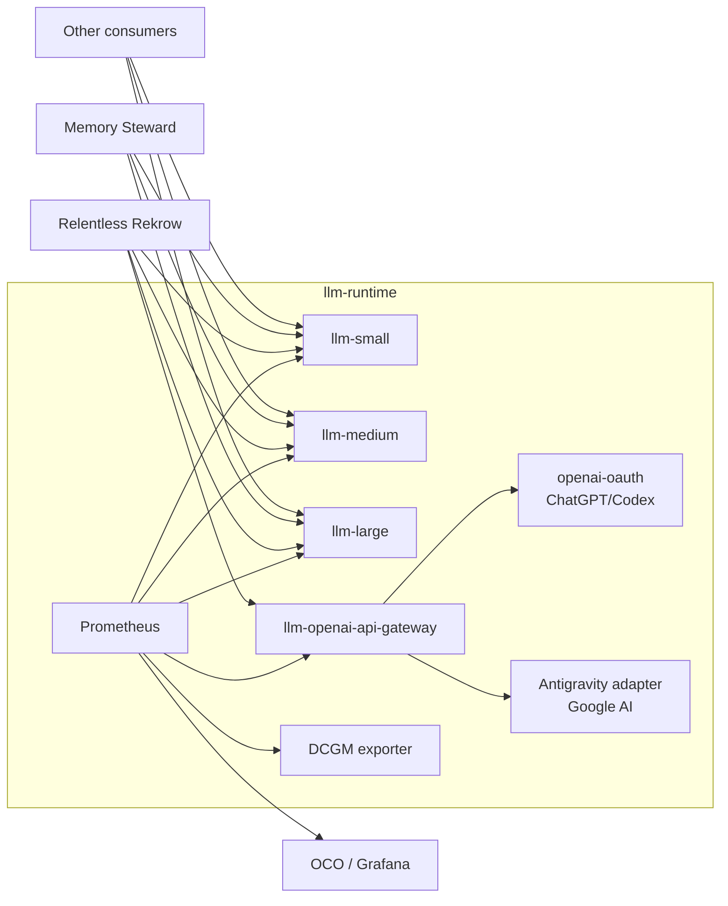

# SHARED LLM RUNTIME MODEL
## Shared Inference and Trusted Provider Infrastructure
### Architecture Specification

---

## Navigation

- [0. Status, Scope, and Authority](#0-status-scope-and-authority)
- [1. Purpose](#1-purpose)
- [2. Design Principles](#2-design-principles)
- [3. Runtime Architecture](#3-runtime-architecture)
- [4. Local Inference Tiers](#4-local-inference-tiers)
- [5. Trusted Subscription Gateway](#5-trusted-subscription-gateway)
- [6. Runtime Contract](#6-runtime-contract)
- [7. Consumer Ownership Boundary](#7-consumer-ownership-boundary)
- [8. Network and Security Boundary](#8-network-and-security-boundary)
- [9. Observability Model](#9-observability-model)
- [10. Repository Ownership](#10-repository-ownership)
- [11. Deployment Lifecycles](#11-deployment-lifecycles)
- [12. Non-Goals](#12-non-goals)

---

## 0. Status, Scope, and Authority

**Status:** IMPLEMENTED

This document describes the architecture implemented by the current
`llm-runtime` manifests, gateway source, Taskfile, and observability resources.
Executable configuration remains authoritative if prose and implementation ever
diverge.

The repository provides shared LLM infrastructure. It does not define the
semantics, prompts, workflows, or authority model of consumer projects.

[Back to top](#navigation)

---

## 1. Purpose

Homel projects need reusable access to both local inference capacity and trusted
subscription-backed frontier models. Duplicating those provider transports,
credentials, model servers, GPU allocations, and metrics inside every project
creates unnecessary operational and security surface.

`llm-runtime` centralizes that infrastructure while keeping project behavior
independent.

The platform therefore owns two classes of service:

1. local capacity-oriented inference tiers;
2. a trusted OpenAI-compatible gateway for subscription-backed providers.

[Back to top](#navigation)

---

## 2. Design Principles

### Stable interfaces, replaceable implementation

Consumers depend on service endpoints and advertised model IDs. They should not
depend on GPU placement, quantization, container topology, or current local
model identity.

### Provider credentials remain in trusted infrastructure

Subscription credentials and provider transports belong to `llm-runtime`, not
to hostile jobs or project agent configuration.

### Project independence

Sharing inference infrastructure does not imply shared prompts, schemas,
workflows, policies, persistence, or authority.

### Observable infrastructure

Local inference and gateway behavior are exported to Prometheus. OCO/Grafana
loads runtime-owned dashboard and datasource contracts from this repository.

### Explicit lifecycle boundaries

Local inference, gateway, observability, and OCO consumer resources have
separate deployment tasks. An operator can change one without implicitly
replacing all others.

[Back to top](#navigation)

---

## 3. Runtime Architecture

All runtime-owned Kubernetes resources use the `llm-runtime` namespace.



The three local tiers are generally consumable across namespaces on port 8000.
The subscription gateway has a narrower ingress policy: RR agent Pods may use
port 8000 and the runtime Prometheus Pod may use metrics port 9091.

[Back to top](#navigation)

---

## 4. Local Inference Tiers

The stable capacity tier names are:

```text
small
medium
large
```

Current manifests deploy:

| Tier | Current implementation | Current model | Relevant capacity |
| --- | --- | --- | --- |
| `small` | llama.cpp server | `Qwen/Qwen2.5-7B-Instruct-GGUF:Q4_K_M` | CPU-backed |
| `medium` | vLLM | `curiousmind147/microsoft-phi-4-AWQ-4bit-GEMM` | 1 GPU |
| `large` | vLLM | `DeepSeek-R1-Distill-Llama-70B-AWQ` | 3 GPUs, pipeline parallel |

These identities are implementation details. A consumer that requires a
specific model identity must explicitly verify `/v1/models`; the tier contract
itself does not promise that identity permanently.

Stable services:

```text
llm-small.llm-runtime.svc.cluster.local:8000
llm-medium.llm-runtime.svc.cluster.local:8000
llm-large.llm-runtime.svc.cluster.local:8000
```

[Back to top](#navigation)

---

## 5. Trusted Subscription Gateway

The gateway is a first-class runtime service, not RR-owned application code.

Stable service:

```text
llm-openai-api-gateway.llm-runtime.svc.cluster.local:8000
```

The Pod contains trusted loopback transports. The externally visible router
does not pass provider credentials to consumers.

Current model aliases:

| Gateway model | Trusted backend |
| --- | --- |
| `gpt-5.6-sol` | `openai-oauth` on loopback port 10531 |
| `gemini-subscription-pro` | Antigravity `gemini-3.1-pro-high` on loopback port 10532 |
| `gemini-subscription-auto` | Antigravity `gemini-3.7-flash-medium` on loopback port 10532 |

The two legacy PVC names `rr-openai-subscription-auth` and
`rr-gemini-subscription-auth` are intentionally retained for migration
continuity. Their names no longer indicate ownership; the resources belong to
`llm-runtime`.

Detailed gateway behavior is documented in [04_gateway.md](04_gateway.md).

[Back to top](#navigation)

---

## 6. Runtime Contract

`k8s/runtime-contract.yml` publishes stable configuration:

```text
LLM_SMALL_BASE_URL
LLM_MEDIUM_BASE_URL
LLM_LARGE_BASE_URL
LLM_GATEWAY_BASE_URL
LLM_RUNTIME_NAMESPACE
LLM_API_COMPATIBILITY
CONTRACT_VERSION
```

The current contract version is `v1` and API compatibility is declared as
`openai`.

The runtime contract intentionally does not expose provider credentials,
quantization parameters, GPU identifiers, provider login state, or project
roles.

See [02_runtime_contract.md](02_runtime_contract.md) for the consumer contract.

[Back to top](#navigation)

---

## 7. Consumer Ownership Boundary

Consumer projects own:

- prompts and schemas;
- workflow and role behavior;
- authority boundaries;
- project timeout/retry policy;
- persistence;
- project-specific tools;
- correctness and quality evaluation;
- project-level observability.

`llm-runtime` owns:

- local model serving;
- stable runtime Services;
- gateway source and provider transports;
- subscription auth PVCs and login helpers;
- gateway image build and publication;
- runtime NetworkPolicy and gateway consumer RBAC;
- Prometheus/DCGM runtime telemetry;
- OCO datasource/dashboard publication;
- runtime deployment and diagnostics tooling.

The boundary is:

```text
llm-runtime owns model/provider infrastructure.
Consumers own application meaning and authority.
```

[Back to top](#navigation)

---

## 8. Network and Security Boundary

Local inference Pods carry `app.kubernetes.io/component: inference` and are
selected by the general runtime consumer NetworkPolicy on TCP/8000.

The gateway uses its own ingress/egress policy:

- RR `rr-pi-agent` Pods may connect to TCP/8000;
- runtime Prometheus may connect to TCP/9091;
- provider sidecars use only Pod loopback for router-to-backend traffic;
- egress allows cluster DNS plus public TCP/443 while excluding private,
  link-local, and CGNAT address ranges;
- containers run non-root with dropped capabilities and read-only root
  filesystems where declared by the gateway Deployment.

Subscription auth is persisted on dedicated PVCs and never becomes part of the
runtime ConfigMap contract.

[Back to top](#navigation)

---

## 9. Observability Model

Runtime metrics production and storage are owned by `llm-runtime`.
Presentation is consumed by OCO/Grafana through the ConfigMaps under
`k8s/oco-consumer/`.

Prometheus jobs include:

```text
vllm-small
vllm-medium
vllm-large
llm-gateway
dcgm-exporter
```

The gateway's dedicated metrics port is TCP/9091. It exports request rate,
backend/model/status dimensions, latency histograms, in-flight requests,
transport errors/timeouts, policy rejects, traffic bytes, last success/error
state, uptime, and process RSS.

Runtime observability answers:

```text
Is model/provider infrastructure healthy and sufficiently provisioned?
```

Consumer observability answers:

```text
Is the chosen model/provider effective for this project workload?
```

[Back to top](#navigation)

---

## 10. Repository Ownership

Relevant repository areas:

```text
gateway/                 trusted gateway implementation and tests
k8s/small/               small local tier
k8s/medium/              medium local tier
k8s/large/               large local tier
k8s/gateway/             gateway Deployment, Service, PVCs, RBAC, login Pods
k8s/observability/       Prometheus and DCGM exporter
k8s/oco-consumer/        Grafana/OCO datasource, dashboards, reader RBAC
k8s/runtime-contract.yml stable consumer endpoint contract
scripts/                 health, smoke, metrics, gateway and exposure helpers
hack/                    benchmark helpers
```

Gateway image CI is owned by `.github/workflows/gateway-image.yml` and publishes
`ghcr.io/homel-dev/llm-runtime-gateway` for trusted events.

[Back to top](#navigation)

---

## 11. Deployment Lifecycles

The root Kustomization deploys the namespace, runtime contract, general
NetworkPolicy, and the three local inference tiers:

```bash
task up
```

The following are explicit additional lifecycles:

```bash
task gateway:deploy
task observability:deploy
task oco-consumer:deploy
```

`task gateway:observability:deploy` is the convenience path that deploys both
runtime monitoring and the OCO consumer contract and then validates the gateway
Prometheus target.

This split is deliberate. `task up` must not be interpreted as "every resource
owned by the repository is now running."

[Back to top](#navigation)

---

## 12. Non-Goals

This repository does not define:

- agent prompts;
- planning or review logic;
- project workflow graphs;
- application persistence;
- application-specific admission rules;
- project-specific quality policy;
- provider selection semantics for individual application roles.

Those remain consumer responsibilities.

---

**END OF DOCUMENT**
