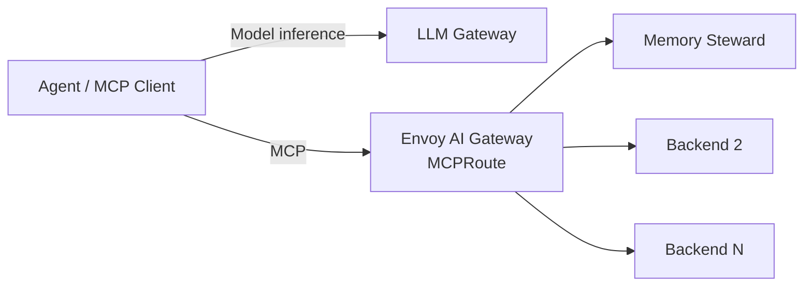
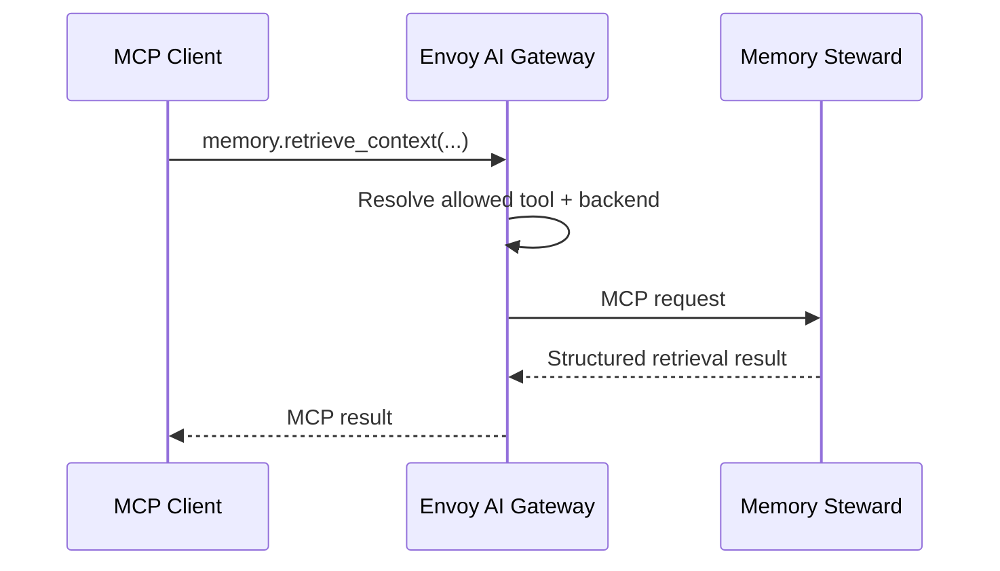
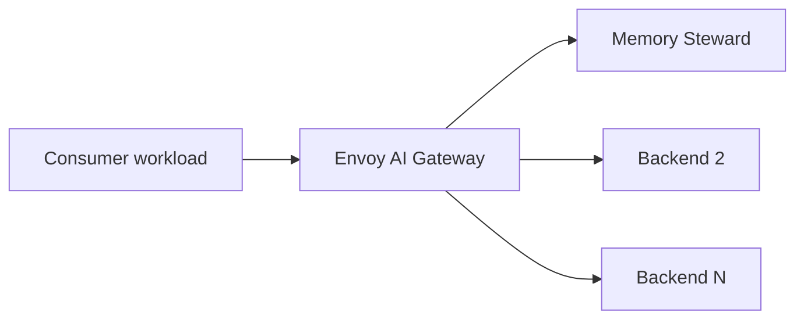

<a id="top" name="top"></a>

# MCP Gateway — Envoy AI Gateway Integration

*Controlled MCP ingress for shared runtime capabilities.*

---

## Table of Contents

- [0. Status, Scope, and Authority](#0-status-scope-and-authority)
- [1. Architecture Decision](#1-architecture-decision)
- [2. Purpose](#2-purpose)
- [3. High-Level Architecture](#3-high-level-architecture)
- [4. Ownership Boundary](#4-ownership-boundary)
- [5. Client Contract](#5-client-contract)
- [6. Backend Model](#6-backend-model)
- [7. Capability Exposure](#7-capability-exposure)
- [8. Initial Backend — Memory Steward](#8-initial-backend--memory-steward)
- [9. Network Boundary](#9-network-boundary)
- [10. Authentication and Credentials](#10-authentication-and-credentials)
- [11. Observability](#11-observability)
- [12. Deployment and Configuration](#12-deployment-and-configuration)
- [13. Validation and Acceptance](#13-validation-and-acceptance)
- [14. Failure Semantics](#14-failure-semantics)
- [15. Versioning and Upgrade Policy](#15-versioning-and-upgrade-policy)
- [16. Non-Goals](#16-non-goals)
- [17. Tradeoffs and Known Constraints](#17-tradeoffs-and-known-constraints)
- [18. Core Invariants](#18-core-invariants)

---

## 0. Status, Scope, and Authority

**Status:** APPROVED ARCHITECTURE — implementation pending.

**Scope:** `llm-runtime`.

**Selected implementation:** Envoy AI Gateway using `MCPRoute`.

This document defines how `llm-runtime` exposes MCP capabilities.

It does **not** define a custom MCP gateway implementation.

`llm-runtime` has authority over:

- deployment of the MCP ingress;
- Envoy AI Gateway configuration owned by this repository;
- `Gateway`, `MCPRoute`, backend-routing, and related policy resources;
- public MCP capability exposure;
- network boundaries;
- runtime-level authentication and backend credential handling;
- runtime-level telemetry;
- deployment, validation, upgrade, and rollback procedures.

Backend services retain authority over their own domain semantics, validation, data, persistence, and business logic.

Executable Kubernetes configuration becomes authoritative after implementation.

[Back to top](#top)

---

## 1. Architecture Decision

`llm-runtime` will use **Envoy AI Gateway** as the MCP ingress implementation.

The runtime will **not** implement its own:

- MCP protocol server;
- capability registry service;
- backend router;
- backend adapter framework;
- session manager;
- authentication framework;
- MCP multiplexing layer;
- administration API;
- administration UI.

The architectural unit owned by `llm-runtime` is configuration around the selected gateway, not a new gateway codebase.

The primary MCP routing primitive is:

```text
MCPRoute
```

The required abstraction is:

```text
MCP Client
    -> Envoy AI Gateway
        -> explicitly configured MCP backend
```

Adding another backend means changing declarative gateway configuration and network policy.

It does not mean adding another client-visible endpoint or writing another routing integration inside `llm-runtime`.

[Back to top](#top)

---

## 2. Purpose

Consumers require one stable MCP ingress for tools and resources provided by independently owned services.

Without a shared ingress, each consumer would need direct knowledge of:

- backend service addresses;
- backend namespaces;
- backend ports;
- backend credentials;
- backend-specific network access;
- backend lifecycle changes.

`llm-runtime` centralizes that infrastructure boundary.

The MCP gateway exists to provide:

```text
stable ingress
+ explicit capability exposure
+ deterministic backend routing
+ infrastructure security controls
+ infrastructure observability
```

It does not own backend application meaning.

[Back to top](#top)

---

## 3. High-Level Architecture

Model inference and MCP capability access remain separate runtime planes.



`LLM Gateway` owns model-provider access.

`Envoy AI Gateway` owns MCP ingress and transport routing.

Backend services own their domain behavior.

These responsibilities MUST remain separate.

The MCP gateway is not placed in the inference request path.

The LLM gateway is not placed in the MCP request path.

[Back to top](#top)

---

## 4. Ownership Boundary

### `llm-runtime` owns

```text
Envoy AI Gateway deployment
Gateway resources
MCPRoute resources
backend routing configuration
tool exposure policy
gateway-facing NetworkPolicy
backend credential attachment
runtime telemetry
health and validation procedures
version pinning
upgrade and rollback
```

### Backend services own

```text
domain semantics
domain validation
domain authorization below the gateway boundary
domain data
persistence
ranking
retrieval
mutation semantics
idempotency semantics
backend-specific correctness
```

### Consumers own

```text
when a capability is invoked
workflow semantics
agent policy
application retry policy
application fallback policy
interpretation of returned data
```

**Invariant:** transport routing does not transfer domain authority to the gateway.

[Back to top](#top)

---

## 5. Client Contract

An MCP client depends on:

```text
one MCP endpoint
+ MCP protocol compatibility
+ publicly exposed capability names
+ required client authentication when enabled
```

A client MUST NOT require knowledge of:

```text
backend Kubernetes Service names
backend namespaces
backend URLs
backend ports
backend credentials
Envoy Backend resources
internal routing topology
gateway controller topology
```

The stable client-facing relationship is:

```text
Client -> MCP Gateway
```

not:

```text
Client -> Memory Steward
Client -> Backend 2
Client -> Backend 3
```

Consumer-specific execution metadata such as `project_id`, `run_id`, `objective_id`, or `agent_role` MAY be transported when useful.

Those fields are not universal MCP gateway identity requirements.

[Back to top](#top)

---

## 6. Backend Model

A backend is an independently owned MCP capability provider reachable through Envoy AI Gateway.

Memory Steward is Backend #1.

Future backends may include:

- artifact services;
- repository-analysis services;
- infrastructure inspection services;
- deterministic analysis services;
- documentation services;
- source-control integrations;
- other explicitly approved MCP services.

Backend destinations are declared by runtime-owned configuration.

Clients MUST NOT supply arbitrary backend destinations.

Dynamic forward-proxy behavior is outside this architecture.

A newly reachable network destination does not become a publicly exposed MCP backend automatically.

Backend addition requires deliberate configuration and validation.

[Back to top](#top)

---

## 7. Capability Exposure

Public capability exposure is **allowlist-based**.

Every backend attached to the runtime MCP ingress MUST declare an explicit tool selection policy.

A backend configuration without an explicit tool allowlist is invalid for `llm-runtime`.

The public contract is therefore:

```text
backend provides capabilities
        |
        v
MCPRoute explicitly selects capabilities
        |
        v
client discovers selected capabilities only
```

Backend reachability and capability exposure are separate decisions.

For example:

```text
Memory Steward backend provides:
    memory.retrieve_context
    memory.operation_b
    memory.operation_c

Runtime MCP ingress exposes:
    memory.retrieve_context
```

The runtime MUST NOT treat backend discovery as authority to publish all backend tools.

Capability filtering belongs in declarative Envoy configuration.

It MUST NOT be duplicated in a custom `llm-runtime` registry service.

[Back to top](#top)

---

## 8. Initial Backend — Memory Steward

The first MCP backend is Memory Steward.

The initial public capability is:

```text
memory.retrieve_context
```

The request path is:



Memory Steward remains responsible for:

```text
Reference Memory
Dynamic Memory
retrieval semantics
metadata filtering
ranking
provenance
admission
Memory Steward validation
storage
```

Envoy AI Gateway does not reproduce those behaviors.

For example, a future change to Reference Memory filtering requires a Memory Steward change.

It does not require implementing the filtering logic in the gateway.

The gateway may validate protocol and routing requirements.

It MUST NOT independently reinterpret Memory Steward domain semantics.

[Back to top](#top)

---

## 9. Network Boundary

The intended network relationship is:



Consumer workloads receive MCP access to the gateway.

They do not receive backend access merely because a backend has been registered.

NetworkPolicy MUST restrict:

```text
approved consumers -> MCP ingress
MCP data plane -> configured backends
required DNS
required telemetry paths
```

Adding Backend N should normally require changing gateway-side egress rather than every consumer workload.

Backend references and gateway-owned routing objects SHOULD remain local to the gateway configuration namespace.

Where the actual backend workload lives in another namespace, runtime configuration may represent that destination through an explicitly configured Envoy backend using the backend service FQDN.

Arbitrary dynamic destination resolution MUST NOT be enabled as a substitute for explicit backend registration.

Public Internet exposure is not implied by this architecture.

[Back to top](#top)

---

## 10. Authentication and Credentials

Authentication has two separate boundaries:

```text
Client -> MCP Gateway
MCP Gateway -> Backend
```

These MUST NOT be conflated.

### Client authentication

The first deployment MAY operate inside a trusted Kubernetes network boundary without production user authentication.

The architecture must preserve the ability to enforce client authentication at the gateway later.

Client authentication must not require redesigning backend services.

### Backend authentication

Backend credentials belong to the gateway/backend boundary.

They MUST NOT be distributed to MCP clients.

Where backend authentication is required, credentials SHOULD be attached through supported gateway security policy and Kubernetes Secret mechanisms.

Credentials MUST NOT be embedded into client configuration or public MCP discovery.

### Authorization

Network reachability alone does not imply unrestricted capability authority.

Public capabilities remain bounded by the configured MCP exposure policy even before full identity-aware authorization is introduced.

[Back to top](#top)

---

## 11. Observability

MCP traffic is part of runtime infrastructure and MUST be observable from the first deployment.

Required signals include:

```text
request count
success/failure count
request duration
backend duration where available
active requests
backend failures
timeouts
request/response sizes where available
selected backend
selected capability/tool
gateway health
```

Distributed traces should cover:

```text
MCP Client
    -> Envoy AI Gateway
    -> Backend
    -> Envoy AI Gateway
    -> MCP Client
```

Trace context SHOULD propagate into a backend when supported.

The MCP ingress should integrate with the existing runtime observability stack:

```text
Prometheus
Grafana / OCO
Tempo
Loki where applicable
```

Exact metric names are implementation details and MUST be validated against the pinned Envoy AI Gateway release.

The architecture does not create a second custom metrics implementation when upstream telemetry already provides the required signal.

[Back to top](#top)

---

## 12. Deployment and Configuration

Envoy AI Gateway is deployed as a separately reconcilable runtime lifecycle.

The `llm-runtime` repository owns:

```text
version pins
Helm or manifest configuration
Gateway configuration
MCPRoute resources
Backend resources where required
security policy
NetworkPolicy
observability integration
validation tooling
```

Configuration is declarative.

Changing public MCP capability exposure MUST NOT require rebuilding a custom gateway image.

The desired structure is conceptually:

```text
k8s/
  mcp/
    gateway/
    routes/
    backends/
    policy/
    network/
    observability/
```

The exact file layout is an implementation decision.

The selected Envoy AI Gateway and Envoy Gateway versions MUST be pinned.

`latest` or otherwise floating production dependencies are not accepted Desired State.

[Back to top](#top)

---

## 13. Validation and Acceptance

Deployment success is not equivalent to MCP acceptance.

The implementation is accepted only when end-to-end validation proves the intended contract.

At minimum, validation MUST establish:

1. the MCP ingress is reachable from an approved consumer;
2. the client can complete MCP initialization;
3. capability discovery succeeds;
4. `memory.retrieve_context` is exposed;
5. non-allowlisted Memory Steward capabilities are not exposed;
6. `memory.retrieve_context` reaches Memory Steward and returns a valid result;
7. an unknown tool remains a failure;
8. an unavailable Memory Steward backend remains a failure;
9. direct consumer access to Memory Steward is not accidentally introduced by the MCP deployment;
10. required gateway telemetry is visible;
11. required trace propagation works where configured;
12. NetworkPolicy permits required paths and rejects unintended paths.

A ready Pod or accepted Kubernetes resource alone is insufficient.

[Back to top](#top)

---

## 14. Failure Semantics

Gateway infrastructure failures remain failures.

The runtime MUST preserve meaningful distinction between:

```text
unknown capability
capability not exposed
malformed MCP request
client authentication failure
client authorization failure
gateway routing failure
backend unavailable
backend connection failure
backend timeout
backend protocol failure
backend application rejection
invalid backend response
gateway internal failure
```

The MCP gateway MUST NOT manufacture successful tool results when backend execution failed.

The gateway MUST NOT silently route a request to another backend unless such behavior is explicitly part of the configured public contract.

Error responses must not expose:

```text
backend credentials
Kubernetes Secrets
unrelated runtime configuration
arbitrary environment variables
unbounded stack traces
```

Backend business errors remain backend-owned.

Transport and routing failures remain gateway-visible.

[Back to top](#top)

---

## 15. Versioning and Upgrade Policy

Envoy AI Gateway, Envoy Gateway, CRDs, and the supported MCP protocol behavior are versioned runtime dependencies.

The repository MUST pin the selected versions.

An upgrade is not accepted from controller readiness alone.

Before promotion, the implementation MUST rerun the MCP acceptance checks from section 13.

In particular, upgrades must verify:

```text
MCP initialization
tools/list behavior
tool filtering
tool invocation
backend routing
backend authentication where used
failure propagation
telemetry
NetworkPolicy behavior
```

MCP protocol compatibility MUST be tested against the actual runtime clients and backends.

The runtime MUST NOT infer compatibility solely from an upstream release number.

Breaking upstream behavior requires explicit migration or rollback.

[Back to top](#top)

---

## 16. Non-Goals

`llm-runtime` will not build:

```text
a custom MCP gateway
a custom MCP server framework
a custom capability-registry service
a custom backend adapter framework
a custom MCP session implementation
a custom MCP authorization framework
an MCP administration UI
an MCP database
a memory database
an artifact database
a generic HTTP proxy
a generic TCP proxy
a generic shell execution gateway
an unrestricted Kubernetes API proxy
```

The runtime also does not move backend business logic into Envoy configuration.

Envoy configuration determines exposure and transport policy.

Backends determine domain behavior.

[Back to top](#top)

---

## 17. Tradeoffs and Known Constraints

Selecting Envoy AI Gateway removes a substantial custom implementation burden but introduces dependency on Envoy AI Gateway, Envoy Gateway, Gateway API resources, and their release compatibility.

Declarative CRDs make runtime behavior reviewable and GitOps-friendly, but they couple the deployment to upstream API semantics.

Explicit tool allowlisting creates operational work when backend capabilities change. That cost is intentional. New backend functionality should not become public accidentally.

Centralizing MCP ingress creates a shared dependency. Gateway failure can affect multiple MCP consumers even when individual backends remain healthy.

The gateway can enforce transport, exposure, identity, and infrastructure policy. It cannot determine whether a backend result is semantically correct.

Backend and MCP protocol compatibility can change independently. Version pinning and end-to-end tests are therefore required even when Kubernetes reconciliation succeeds.

Cross-namespace backend topology must not be assumed to work through arbitrary direct route references. Backend addressing must use a topology supported and tested by the pinned Envoy release.

[Back to top](#top)

---

## 18. Core Invariants

### 18.1 One stable MCP ingress

Consumers integrate with the runtime MCP endpoint rather than every backend independently.

### 18.2 Envoy is the implementation

`llm-runtime` configures Envoy AI Gateway.

It does not implement a competing MCP gateway.

### 18.3 Explicit exposure only

Every public backend capability is deliberately allowlisted.

### 18.4 No arbitrary destinations

Clients cannot choose backend URLs, Services, namespaces, or network destinations.

### 18.5 Backend semantics remain backend-owned

Routing infrastructure does not reproduce backend application logic.

### 18.6 Backend credentials remain behind the gateway

Clients do not receive backend credentials.

### 18.7 Consumer-specific metadata remains optional

RR execution concepts do not become universal MCP gateway fields.

### 18.8 Observability is mandatory

MCP routing must be visible through runtime telemetry.

### 18.9 Failure remains failure

Gateway or backend failure is not converted into synthetic success.

### 18.10 Backend growth does not change client ingress

Adding Backend N means:

```text
deploy backend
    -> configure backend destination
    -> explicitly allow capabilities
    -> permit required gateway egress
    -> validate
```

It does not mean:

```text
modify every MCP client
    -> expose backend directly
    -> distribute backend credentials
```

### 18.11 The gateway remains infrastructure

Envoy AI Gateway owns:

```text
MCP ingress
+ capability exposure
+ routing
+ transport policy
+ infrastructure security
+ infrastructure telemetry
```

Backends own:

```text
domain semantics
+ domain validation
+ domain state
+ persistence
+ correctness
```

[Back to top](#top)

---

**END OF DOCUMENT**
