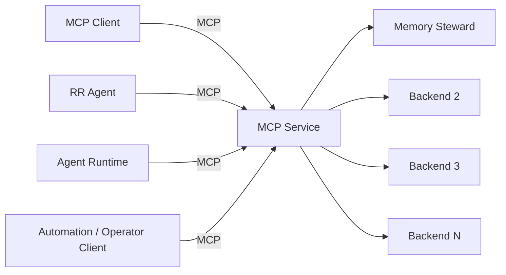
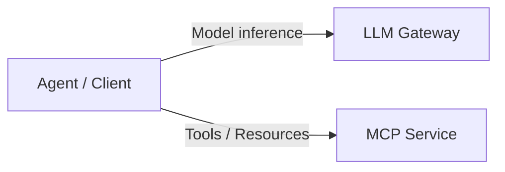
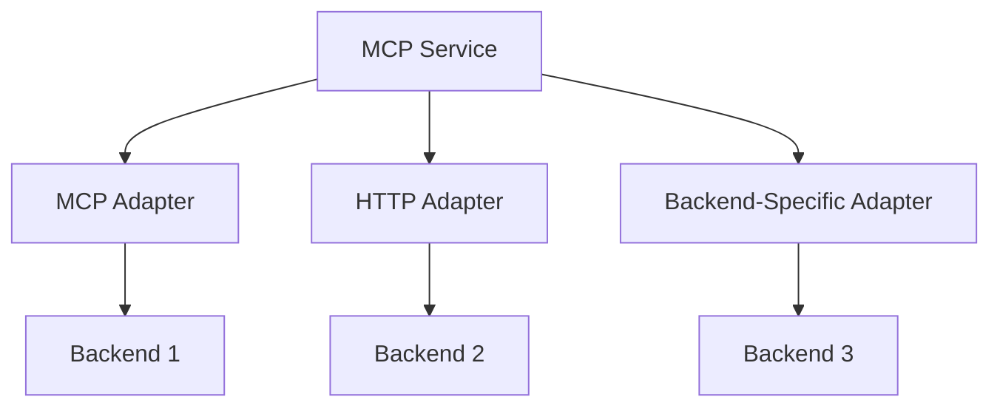
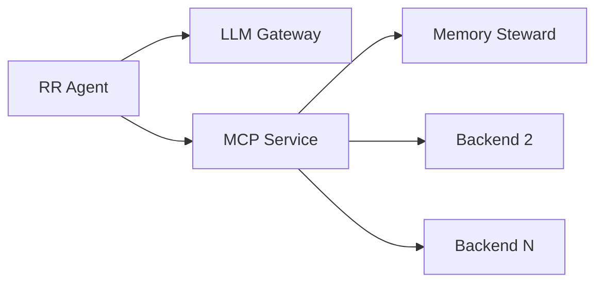
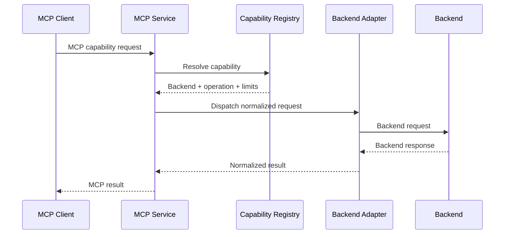
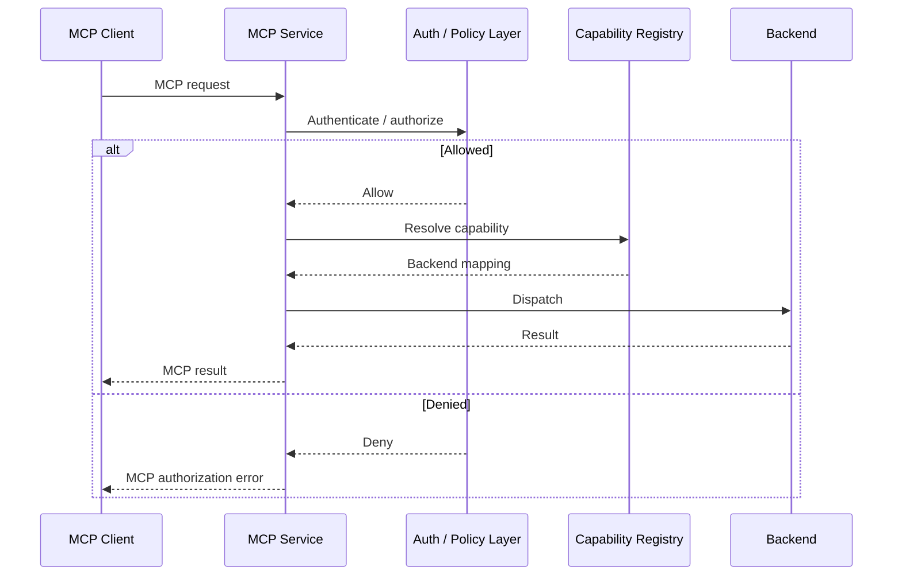
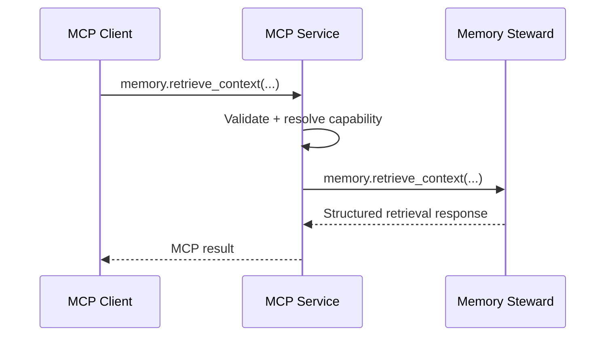

<a id="top" name="top"></a>

# MCP Service — Unified MCP Gateway for LLM Runtime

## Status

**Status:** Proposed Architecture  
**Scope:** `llm-runtime`  
**Implementation priority:** MVP  
**Primary purpose:** provide one stable MCP ingress through which MCP clients access explicitly exposed tools and resources backed by independent services.

---

## Table of Contents

1. [Purpose](#purpose)
2. [Core Architectural Principles](#core-architectural-principles)
3. [High-Level Architecture](#high-level-architecture)
4. [Client Model](#client-model)
5. [MCP Service Responsibilities](#mcp-service-responsibilities)
6. [Backend Model](#backend-model)
7. [Capability Registry](#capability-registry)
8. [Routing and Backend Adapters](#routing-and-backend-adapters)
9. [Capability Discovery](#capability-discovery)
10. [Network Boundary](#network-boundary)
11. [Authentication and Authorization — Deferred](#authentication-and-authorization)
12. [Credentials and Credential Rotation — Deferred](#credentials-and-credential-rotation)
13. [Request Lifecycle](#request-lifecycle)
14. [Failure Semantics](#failure-semantics)
15. [Limits and Isolation](#limits-and-isolation)
16. [Observability](#observability)
17. [Deployment Model](#deployment-model)
18. [Configuration Model](#configuration-model)
19. [Initial Backend: Memory Steward](#initial-backend-memory-steward)
20. [MVP Scope](#mvp-scope)
21. [Deferred Capabilities](#deferred-capabilities)
22. [Non-Goals](#non-goals)
23. [Core Invariants](#core-invariants)

---

<a id="purpose" name="purpose"></a>

## 1. Purpose

`MCP Service` is a trusted service deployed in `llm-runtime`.

It provides the **single stable MCP ingress** for clients that need access to tools, resources, and other capabilities exposed through MCP.

The service is generic.

It is **not RR-specific** and MUST NOT encode RR-specific assumptions into its core architecture.

RR agents are one consumer of MCP Service.

Other current or future consumers may include:

- other agent runtimes;
- operator agents;
- automation workers;
- development tools;
- IDE integrations;
- internal services acting as MCP clients.

MCP Service hides backend topology from clients.

A client interacts with MCP Service rather than establishing independent connections to every backend capability provider.

The basic abstraction is:

```text
MCP Client
    -> MCP Service
        -> Backend 1
        -> Backend 2
        -> Backend 3
        -> Backend N
```

Memory Steward is the first backend integration.

It is not a special architectural case and does not define the MCP Service design.

[Back to top](#top)

---

<a id="core-architectural-principles" name="core-architectural-principles"></a>

## 2. Core Architectural Principles

### 2.1 Single MCP ingress

Clients use one MCP endpoint.

Individual backend service addresses are not part of the client-facing contract.

### 2.2 Backend independence

Every backend remains independently implemented and independently owned.

MCP Service routes capabilities to backends but does not absorb their business logic.

### 2.3 Generic core

MCP Service core MUST NOT contain assumptions that all tools:

- belong to RR;
- belong to Memory Steward;
- require `project_id`;
- require `run_id`;
- use the same backend protocol;
- use the same authentication method;
- live in the same Kubernetes namespace.

### 2.4 Explicit capability exposure

Only explicitly registered capabilities are exposed.

A backend being reachable by MCP Service does not automatically expose everything that backend provides.

### 2.5 Stable client contract

Adding Backend N should not require changing the MCP endpoint used by existing clients.

### 2.6 Controlled routing

The client selects a public MCP capability.

MCP Service selects the configured backend and backend operation.

Clients MUST NOT provide arbitrary backend destinations.

### 2.7 Backend credentials remain private

Backend credentials belong to MCP Service or its backend adapters.

They are not distributed to MCP clients.

### 2.8 Observability from the beginning

Every routed operation must be observable and attributable to a request.

### 2.9 Security architecture without premature implementation

Authentication, authorization, and credential rotation are required architectural concerns.

Full production implementation is explicitly deferred from the MVP.

The initial architecture MUST nevertheless provide clear insertion points for them.

[Back to top](#top)

---

<a id="high-level-architecture" name="high-level-architecture"></a>

## 3. High-Level Architecture



Within `llm-runtime`, model access and tool access are separate planes:



`LLM Gateway` owns model inference access.

`MCP Service` owns MCP capability access.

These responsibilities MUST remain separate.

[Back to top](#top)

---

<a id="client-model" name="client-model"></a>

## 4. Client Model

An MCP client should only need to know:

- MCP Service endpoint;
- supported MCP transport;
- MCP protocol contract;
- capabilities returned through discovery;
- authentication information when authentication is enabled.

The client MUST NOT need to know:

- backend Kubernetes Service names;
- backend namespaces;
- backend ports;
- backend URLs;
- backend credentials;
- backend implementation languages;
- internal adapter configuration;
- internal routing topology.

Consumer-specific context MAY be associated with a connection or request.

Examples include:

- project identity;
- run identity;
- objective identity;
- agent role;
- session identity;
- tenant identity;
- environment.

Such information is optional context.

It is not part of the universal MCP Service identity model.

For example, RR may provide:

- `run_id`;
- `objective_id`;
- `project_id`;
- `agent_role`.

Another client may have none of those concepts.

MCP Service core MUST remain functional without RR-specific metadata.

[Back to top](#top)

---

<a id="mcp-service-responsibilities" name="mcp-service-responsibilities"></a>

## 5. MCP Service Responsibilities

MCP Service is responsible for:

- exposing the MCP server endpoint;
- MCP protocol handling;
- capability discovery;
- public tool registration;
- public resource registration;
- request schema validation;
- capability resolution;
- backend resolution;
- backend dispatch;
- protocol adaptation where required;
- request timeout enforcement;
- request-size enforcement;
- response-size enforcement;
- cancellation handling where supported;
- backend error normalization;
- structured logging;
- metrics;
- distributed tracing;
- backend health reporting.

MCP Service MUST NOT:

- reproduce backend business logic;
- implement Memory Steward retrieval semantics;
- become an artifact database;
- become a memory database;
- become a generic HTTP proxy;
- become a generic TCP proxy;
- allow clients to provide arbitrary destination URLs;
- automatically expose every operation offered by a backend.

The service acts as a controlled capability gateway.

[Back to top](#top)

---

<a id="backend-model" name="backend-model"></a>

## 6. Backend Model

A backend is an independently implemented capability provider reachable by MCP Service.

Examples may include:

- Memory Steward;
- artifact services;
- repository-analysis services;
- source-control integrations;
- infrastructure inspection services;
- documentation services;
- deterministic analysis services;
- other MCP servers.

A backend may expose:

- MCP;
- HTTP;
- another explicitly supported internal protocol.

MCP Service provides a single client-facing MCP surface regardless of the backend transport.



Backend #1 is Memory Steward.

Backend #2 through Backend N must be addable without redesigning the agent-facing protocol.

[Back to top](#top)

---

<a id="capability-registry" name="capability-registry"></a>

## 7. Capability Registry

MCP Service maintains an explicit registry of public capabilities.

A public capability may be:

- an MCP tool;
- an MCP resource;
- another MCP capability type supported later.

For each public capability, the registry should define at minimum:

- public capability name;
- capability type;
- description;
- input schema where applicable;
- backend ID;
- backend operation;
- adapter type;
- timeout;
- maximum request size;
- maximum response size;
- read/write classification;
- optional policy reference.

Example:

```yaml
backends:
  memory-steward:
    adapter: mcp
    endpoint: http://memory-steward-mcp.namespace.svc:8000

tools:
  memory.retrieve_context:
    backend: memory-steward
    operation: memory.retrieve_context
    access: read
    timeout: 60s
```

The registry is allowlist-based.

The following unrestricted capability pattern MUST NOT be part of the default design:

```text
http.request(url, ...)
proxy.request(destination, ...)
tcp.connect(host, port)
shell.exec(command)
```

Such capabilities would bypass explicit backend registration and routing policy.

[Back to top](#top)

---

<a id="routing-and-backend-adapters" name="routing-and-backend-adapters"></a>

## 8. Routing and Backend Adapters

Routing is deterministic.

For every capability request:

```text
public capability
    -> capability registry
    -> backend ID
    -> backend adapter
    -> backend operation
```

The caller selects the public capability.

The caller does not select:

- backend URL;
- backend Service;
- namespace;
- transport;
- credentials.

A backend adapter is responsible for transport and protocol adaptation.

An adapter MAY:

- transform request shape;
- transform response shape;
- attach backend authentication;
- attach transport metadata;
- apply backend-specific timeout;
- normalize backend transport failures;
- propagate tracing context.

An adapter MUST NOT recreate backend domain logic.

Example:

```text
memory.retrieve_context
```

is implemented by Memory Steward.

MCP Service routes the call to Memory Steward.

It does not independently implement Reference Memory filtering, ranking, retrieval, or admission semantics.

[Back to top](#top)

---

<a id="capability-discovery" name="capability-discovery"></a>

## 9. Capability Discovery

MCP Service owns the client-visible capability catalog.

Clients perform discovery against MCP Service.

They do not perform discovery against individual backends.

Backend capabilities and publicly exposed capabilities are separate sets.

For example:

```text
Backend exposes:
    operation.a
    operation.b
    operation.c
    operation.d

MCP Service exposes:
    operation.a
    operation.c
```

Backend registration MUST NOT automatically publish every backend capability.

Public exposure must be explicit.

When authorization is implemented, discovery MAY additionally filter capabilities based on client policy.

[Back to top](#top)

---

<a id="network-boundary" name="network-boundary"></a>

## 10. Network Boundary

MCP clients should not require direct network access to individual backends.

For RR agents, the intended runtime model is:



The important scaling property is:

> Adding another MCP backend does not require adding that backend as a direct egress destination to every client workload.

Instead:

```text
Client -> MCP Service -> Backend
```

MCP Service receives the backend egress required by its configured registry.

Clients receive access to MCP Service.

Public Internet access is not implied by this architecture.

NetworkPolicy should be capability-driven and narrow:

- client workloads -> MCP Service;
- MCP Service -> configured backend services;
- required cluster DNS;
- required observability endpoints.

[Back to top](#top)

---

<a id="authentication-and-authorization" name="authentication-and-authorization"></a>

## 11. Authentication and Authorization — Deferred

Authentication and authorization are required architectural concerns.

They are **not an MVP implementation priority**.

The first deployment may operate inside a trusted cluster boundary without full production authentication and authorization.

This is intentional.

The architecture must preserve a clear future request pipeline:

```text
request
    -> authentication
    -> authorization
    -> capability resolution
    -> backend dispatch
```

Possible future authentication approaches include:

- OAuth 2.1 / OIDC;
- external Authorization Server / IdP;
- Kubernetes workload identity;
- mTLS client identity;
- short-lived signed service tokens;
- development-only static tokens.

Possible future authorization approaches include:

- OAuth scopes;
- service/client roles;
- declarative capability policy;
- RBAC;
- ABAC;
- external policy engine.

Possible authorization inputs include:

- authenticated client identity;
- requested capability;
- read/write classification;
- tenant context;
- project context;
- consumer-specific execution attributes;
- backend-specific policy.

No production authentication provider or authorization backend is selected by this document.

For MVP, authorization MAY effectively be:

```text
trusted client with network access -> allowed registered capabilities
```

provided the implementation keeps the authorization interception point explicit.

**Full authentication and authorization implementation is deferred.**

[Back to top](#top)

---

<a id="credentials-and-credential-rotation" name="credentials-and-credential-rotation"></a>

## 12. Credentials and Credential Rotation — Deferred

Client identity and backend credentials are separate concerns.

Some backends may eventually require MCP Service to authenticate when dispatching requests.

Possible backend credential mechanisms include:

- workload identity;
- mTLS certificates;
- short-lived service tokens;
- OAuth client credentials;
- static API keys where unavoidable.

Backend credentials belong to:

```text
MCP Service
    or
Backend Adapter
```

They do not belong to MCP clients.

This allows backend credentials to be rotated independently of client configuration.

Possible future credential storage and rotation mechanisms include:

- Kubernetes Secrets;
- external secret manager;
- workload identity;
- certificate automation;
- short-lived token acquisition.

Credential rotation automation is **not part of the MVP**.

For the first backend integrations, the simplest trusted-cluster mechanism supported by the backend may be used.

The architecture must preserve this invariant:

> Backend credentials are owned by the MCP Service/backend boundary and are never exposed to clients.

[Back to top](#top)

---

<a id="request-lifecycle" name="request-lifecycle"></a>

## 13. Request Lifecycle

The MVP request path is:



The future secured path becomes:



Security can therefore be introduced without changing backend ownership or the public capability model.

[Back to top](#top)

---

<a id="failure-semantics" name="failure-semantics"></a>

## 14. Failure Semantics

MCP Service must preserve meaningful failure classes.

At minimum:

- unknown capability;
- malformed MCP request;
- request schema violation;
- backend not configured;
- backend unavailable;
- backend connection failure;
- backend timeout;
- backend rejected request;
- invalid backend response;
- request too large;
- response too large;
- internal MCP Service failure;
- authentication failure when enabled;
- authorization failure when enabled.

A backend failure MUST remain a failure.

MCP Service MUST NOT create a synthetic successful response when backend execution failed.

Errors returned to clients should provide enough bounded diagnostic information for:

- caller reasoning;
- retry decisions;
- automated repair where applicable;
- operator diagnostics.

Errors MUST NOT expose:

- secrets;
- credentials;
- unrelated backend configuration;
- arbitrary environment variables;
- unrestricted stack dumps.

[Back to top](#top)

---

<a id="limits-and-isolation" name="limits-and-isolation"></a>

## 15. Limits and Isolation

MCP Service should enforce infrastructure-level limits.

Per capability or backend, configuration may define:

- request timeout;
- maximum request size;
- maximum response size;
- maximum concurrent calls;
- optional rate limit;
- cancellation behavior;
- retry policy.

A backend should not be able to consume unbounded MCP Service capacity.

Backend-specific failure or latency must remain isolated as much as practical.

Automatic retries must be conservative.

Mutating operations MUST NOT be automatically retried unless their backend contract explicitly guarantees safe idempotency.

Read-only operations MAY use bounded retries when explicitly configured.

[Back to top](#top)

---

<a id="observability" name="observability"></a>

## 16. Observability

Observability is required from the MVP.

Every MCP capability invocation should emit structured telemetry.

Minimum fields should include:

- request ID;
- timestamp;
- capability name;
- capability type;
- backend ID;
- backend operation;
- total duration;
- backend duration;
- result status;
- error class;
- request size;
- response size;
- timeout state.

Where trusted consumer context exists, telemetry MAY additionally contain fields such as:

- client identity;
- project ID;
- run ID;
- objective ID;
- agent role;
- session ID;
- tenant ID.

These fields are optional extension metadata.

They are not mandatory core MCP Service fields.

Metrics should include:

- request count;
- request count by capability;
- request count by backend;
- success count;
- failure count;
- latency distributions;
- active requests;
- timeout count;
- backend availability;
- response-size distributions.

Distributed tracing should cover the complete path:

```text
MCP Client
    -> MCP Service
    -> Backend Adapter
    -> Backend
    -> MCP Service
    -> MCP Client
```

Trace context should propagate into backends that support it.

MCP Service should integrate with the existing `llm-runtime` observability stack:

- Prometheus;
- Grafana;
- Tempo;
- Loki where applicable.

[Back to top](#top)

---

<a id="deployment-model" name="deployment-model"></a>

## 17. Deployment Model

MCP Service is an independent workload deployed in `llm-runtime`.

Expected Kubernetes resources include:

```text
Deployment/mcp-service
Service/mcp-service
ConfigMap or equivalent configuration
NetworkPolicy
ServiceMonitor or PodMonitor
Secret references when eventually required
```

MCP Service should remain stateless with respect to backend application data.

Durable domain data remains owned by individual backends.

MCP Service may maintain ephemeral state required by the protocol or runtime, such as:

- active sessions;
- connection state;
- bounded caches;
- backend health state;
- transient routing state.

The service must be restartable without loss of backend domain data.

[Back to top](#top)

---

<a id="configuration-model" name="configuration-model"></a>

## 18. Configuration Model

Configuration should be external to the application image.

At minimum, configuration should eventually cover:

- MCP listener settings;
- backend registry;
- capability registry;
- backend endpoints;
- adapter types;
- timeout values;
- request limits;
- response limits;
- concurrency limits;
- health checks;
- optional policy references;
- optional credential references.

Example conceptual configuration:

```yaml
backends:
  memory-steward:
    adapter: mcp
    endpoint: http://memory-steward-mcp.namespace.svc:8000

tools:
  memory.retrieve_context:
    backend: memory-steward
    operation: memory.retrieve_context
    timeout: 60s
    max_request_bytes: 262144
    max_response_bytes: 1048576
```

The exact configuration schema is an implementation decision and is not fixed by this architecture document.

Configuration changes should not require rebuilding the MCP Service image.

[Back to top](#top)

---

<a id="initial-backend-memory-steward" name="initial-backend-memory-steward"></a>

## 19. Initial Backend: Memory Steward

Memory Steward is the first backend integrated with MCP Service.

It is one backend among potentially many.

The initial useful agent-facing operation is:

```text
memory.retrieve_context
```

Expected flow:



Memory Steward remains responsible for its own semantics, including:

- Reference Memory;
- Dynamic Memory;
- retrieval behavior;
- metadata filtering;
- ranking;
- provenance;
- admission;
- Memory Steward-specific validation.

MCP Service remains responsible for:

- public capability exposure;
- routing;
- transport;
- generic validation;
- infrastructure limits;
- observability;
- future authentication and authorization enforcement.

Memory Steward-specific retrieval logic MUST NOT be implemented in the MCP Service core.

Future Memory Steward operations may be exposed through the same backend registration mechanism.

[Back to top](#top)

---

<a id="mvp-scope" name="mvp-scope"></a>

## 20. MVP Scope

The first implementation should remain deliberately bounded.

MVP should include:

1. deploy `mcp-service` in `llm-runtime`;
2. expose one MCP endpoint;
3. implement MCP capability discovery;
4. implement backend registry;
5. implement explicit capability registry;
6. implement deterministic capability routing;
7. implement backend adapter abstraction;
8. integrate Memory Steward as Backend #1;
9. expose `memory.retrieve_context`;
10. implement request timeout enforcement;
11. implement request-size limits;
12. implement response-size limits;
13. implement backend health handling;
14. implement structured error responses;
15. implement structured logs;
16. implement Prometheus metrics;
17. implement trace propagation;
18. add required Kubernetes NetworkPolicies;
19. add routing tests;
20. add timeout tests;
21. add malformed-request tests;
22. add unavailable-backend tests;
23. add capability-not-found tests.

The following are explicitly **not required for MVP completion**:

- production authentication;
- production authorization;
- external IdP integration;
- credential rotation automation;
- advanced RBAC or ABAC;
- dynamic backend self-registration.

[Back to top](#top)

---

<a id="deferred-capabilities" name="deferred-capabilities"></a>

## 21. Deferred Capabilities

The following capabilities are intentionally deferred:

- production authentication;
- production authorization;
- OAuth/OIDC integration;
- workload identity integration;
- RBAC;
- ABAC;
- external authorization policy engine;
- automated credential rotation;
- dynamic backend registration;
- dynamic capability publication;
- administrative UI;
- public MCP federation;
- external arbitrary MCP server federation;
- multi-tenant policy;
- per-client quotas;
- advanced retry orchestration;
- destructive-operation approval workflows.

The architecture should permit these features to be added later without replacing the core MCP routing model.

[Back to top](#top)

---

<a id="non-goals" name="non-goals"></a>

## 22. Non-Goals

MCP Service is NOT:

- an LLM gateway;
- an RR-specific service;
- a Memory Steward replacement;
- a memory database;
- an artifact database;
- a generic HTTP proxy;
- a generic TCP proxy;
- a generic shell execution gateway;
- an unrestricted Kubernetes API proxy;
- a place to duplicate backend application logic;
- a mechanism that automatically exposes every backend operation.

Its responsibility is:

> Provide one controlled MCP ingress and route explicitly registered MCP capabilities to independently owned backend services.

[Back to top](#top)

---

<a id="core-invariants" name="core-invariants"></a>

## 23. Core Invariants

### 23.1 One stable MCP ingress

Clients connect to MCP Service rather than individually integrating with every backend.

### 23.2 Backend independence

Memory Steward is Backend #1.

It does not define MCP Service semantics and does not constrain future backends.

### 23.3 Explicit exposure

Only explicitly registered tools and resources are publicly exposed.

### 23.4 No arbitrary backend destinations

Clients cannot provide arbitrary backend URLs or addresses.

### 23.5 No duplicated backend semantics

Application business logic remains backend-owned.

### 23.6 Backend credentials remain behind MCP Service

Backend credentials are never distributed to MCP clients.

### 23.7 Consumer-specific metadata remains optional

RR execution concepts do not become mandatory fields in the generic MCP Service contract.

### 23.8 Observability is mandatory

Every routed capability invocation must be observable.

### 23.9 Security is architecturally reserved but implementation is deferred

Authentication, authorization, and credential rotation have explicit extension points but are not MVP priorities.

### 23.10 Backend growth does not change client ingress

Adding Backend N means:

```text
deploy/register backend
    -> register selected capabilities
    -> configure routing
```

It does not mean:

```text
modify every MCP client
    -> expose new backend endpoint
    -> distribute new backend credentials
```

### 23.11 MCP Service remains a gateway, not a monolith

The service owns:

```text
MCP ingress
+ capability exposure
+ routing
+ transport adaptation
+ infrastructure limits
+ observability
```

Backends own:

```text
domain semantics
+ domain validation
+ domain data
+ backend-specific business logic
```

[Back to top](#top)
